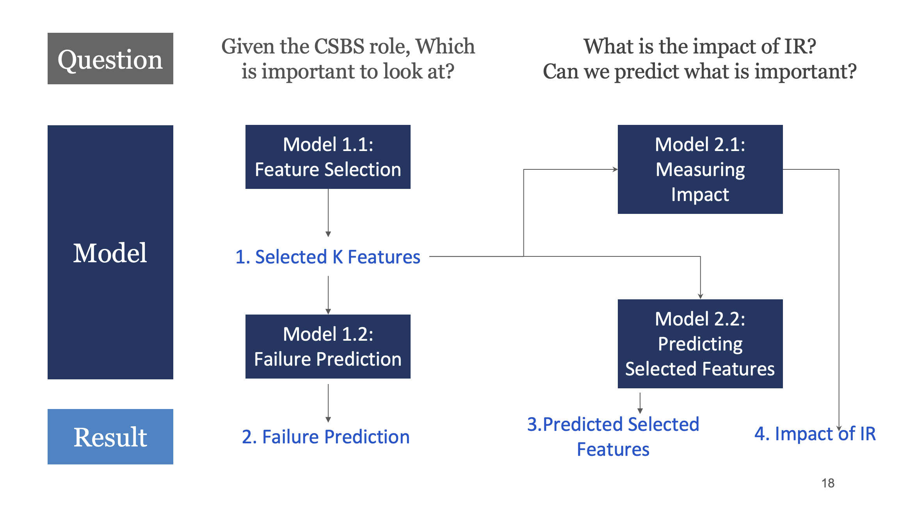

# Impact of Interest Rate Risk on Community Banks

## Overview

This study investigates the impact of interest rate changes on the performance indicators of community banks. We explore the correlation between interest rates and community bank failures, hypothesizing that certain key factors influenced by interest rates could serve as predictors for bank failures.

## Data Collection
- **FDIC Bank Financials:** Basic quarterly financial information filed by banks for 2003-2022.
- **FDIC Bank Failures:** Historical data of community banks that failed between 1990-2022.
- **Federal Funds Rate:** Historical data of federal funds rate between 1950-2022.

## Methodology
- Feature Selection: Identifying key variables that can predict bank failures.
- Failure Prediction: Building models to predict bank failures based on selected features.
- Measuring Impact: Assessing the impact of interest rates on bank health metrics.
- Predicting Selected Features: Forecasting important features based on financial metrics.

## Results
- We identified features that can predict bank failures with 97% accuracy.
- Three bank features were found to be significantly affected by interest rates.

## Conclusion
Our study highlights the importance of monitoring key variables impacted by interest rates to assess the risk of bank failures. Future work will focus on expanding the training data period and adding more features to the dataset.
